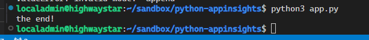
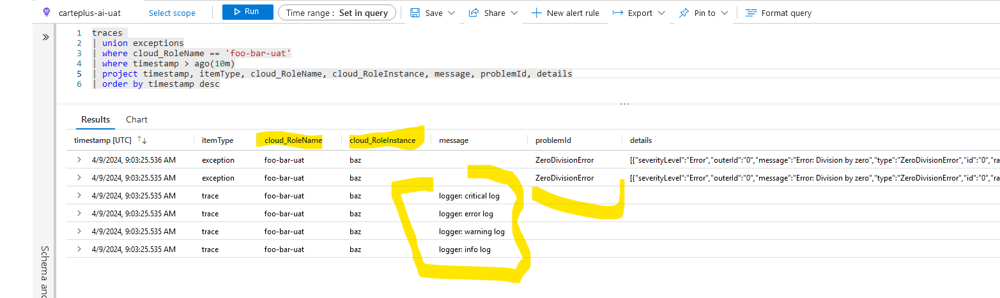

## Environment variables set

```text
export APPLICATIONINSIGHTS_CONNECTION_STRING="<app-insights-connection-string>"
export OTEL_RESOURCE_ATTRIBUTES="service.instance.id=baz"
export OTEL_SERVICE_NAME="foo-bar-uat"
```

## Output of the program



## Querying in Azure AppInsights

